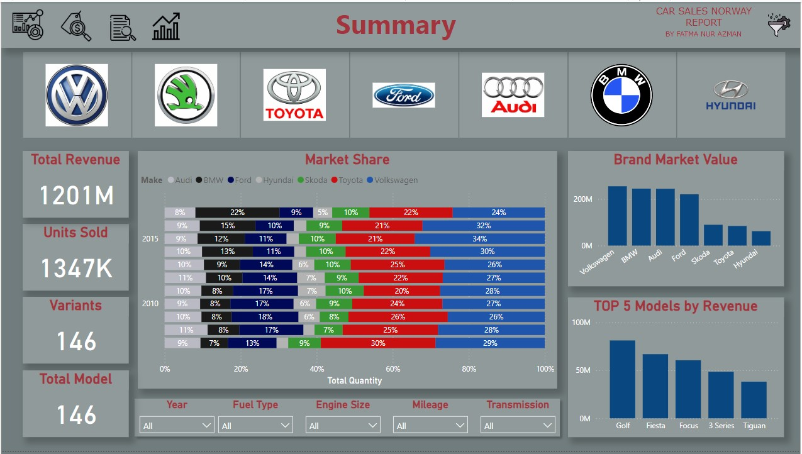

# 🚗 Car Sales Norway Report


## 📌 Overview

Welcome to the **Car Sales Norway Report**! This project focuses on analyzing car sales data in Norway. The dataset includes detailed information on car models, manufacturers, market share, and revenue. The aim is to understand the performance of various car brands in the Norwegian market and identify potential insights through comprehensive data analysis and visualization.

## 📊 Dashboard Snapshots

### Summary


### Price Analysis


### Detailed Sales Analysis


### Trends Analysis


### Thank You


## 📁 Project Structure

Here's a breakdown of the project structure:

- `car_sales_analysis.ipynb`: The core Jupyter Notebook containing the comprehensive analysis.
- `cars_dataset.xlsx`: The dataset used for our analysis, filled with detailed sales data.
- `README.md`: You're reading it! This file provides an overview and guidance for the project.
- `LICENSE`: The licensing details for the project.
- `Images/`: Contains all the dashboard snapshot images used in this README.

## 📦 Installation

To get started with this project, follow these steps:

 **Clone the repository:**
 
```bash
git clone https://github.com/Fatma-Nur-Azman/car_sales_norway_report.git
cd car_sales_norway_report
```
## 🚀 Usage
To explore the Global Superstore data:

Open the Jupyter Notebook:
```bash
jupyter notebook car_sales_analysis.ipynb
```
Run the cells in the notebook to perform the analysis.

## 🎯 Goals
This project aims to:

Analyze car sales data by brand, model, and price.
Identify key factors affecting market share and revenue.
Provide actionable insights for car manufacturers and stakeholders.

## About Me

Hello! I'm Fatma NUr AZMAN, a data analytics and data science enthusiast.

📊 Data Detective: Getting lost in data and turning it into meaningful insights is my hobby. Playing with data and deciphering its language is my superpower!

☕ Coffee Lover: I always have a cup of coffee by my side while analyzing data. Good coffee fuels my creativity.

🎵 Music Enthusiast: Light jazz music playing in the background keeps me motivated while analyzing data. Music helps me stay focused and productive.

🧩 Puzzle Master: I solve puzzles to keep my mind active. This helps improve my analytical thinking skills.

📧 Contact

- [LinkedIn](https://www.linkedin.com/in/fatma-nur-azman/)
- [GitHub](https://github.com/Fatma-Nur-Azman)
- [Website](https://fatmanurazman.vercel.app/)
- [Kaggle](https://www.kaggle.com/fnurazman)
- [Medium](https://medium.com/@azmanfnur)
- [Tableau Public](https://public.tableau.com/app/profile/fatma.nur.azman/vizzes)
  
Are you ready to embark on new journeys in the world of data analytics together? 🚴‍♀️🚴‍♂️

## 📜 License

This project is licensed under the MIT License - see the `LICENSE` file for details.


## 🤝 Contributing
We welcome contributions! If you have suggestions, improvements, or find bugs, feel free to fork the repository and submit a pull request.

## 🌟 Acknowledgements
Special thanks to the data providers.
Gratitude to the open-source community for providing the tools and resources.
Thank you for visiting our project! We hope you find it insightful and engaging. 👩‍💼


