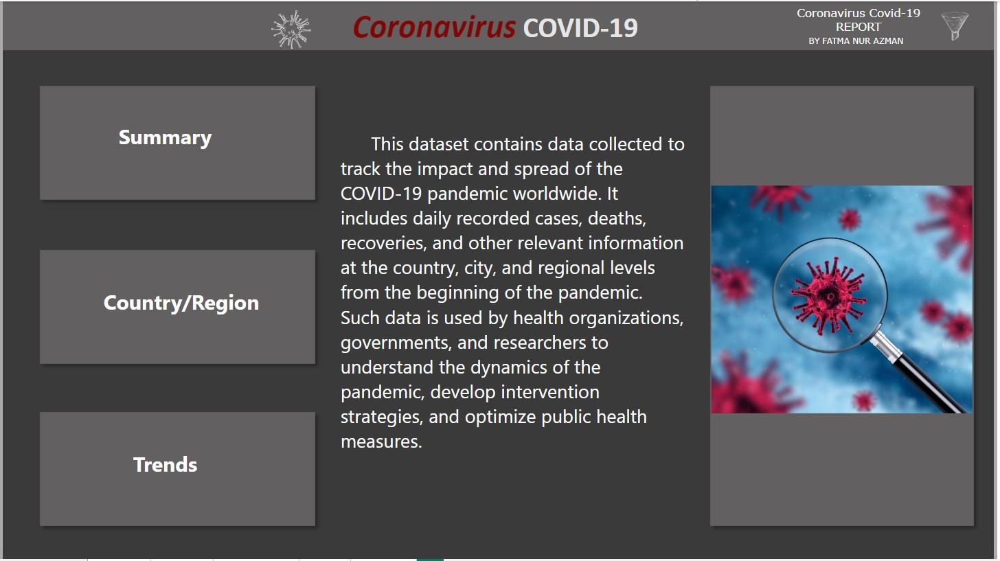
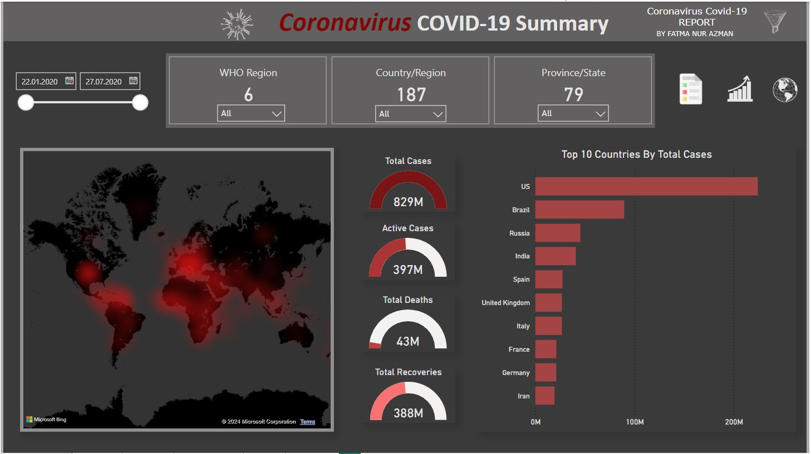
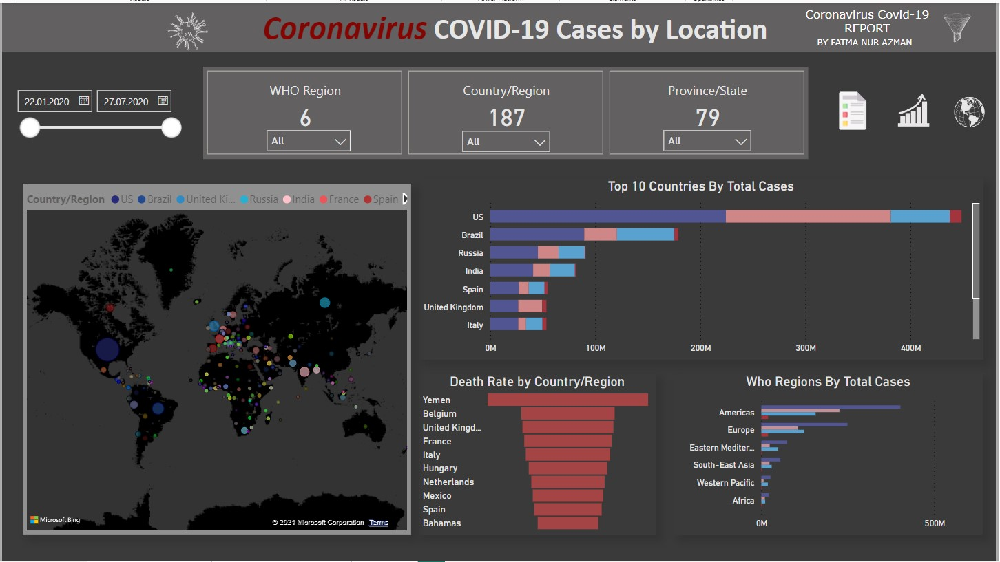
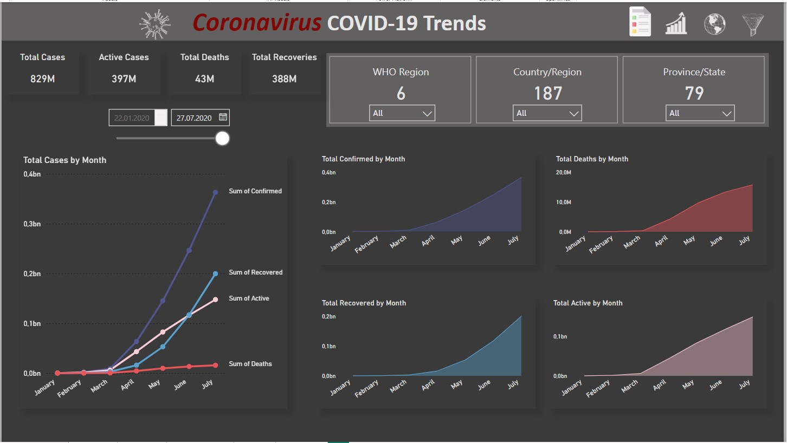
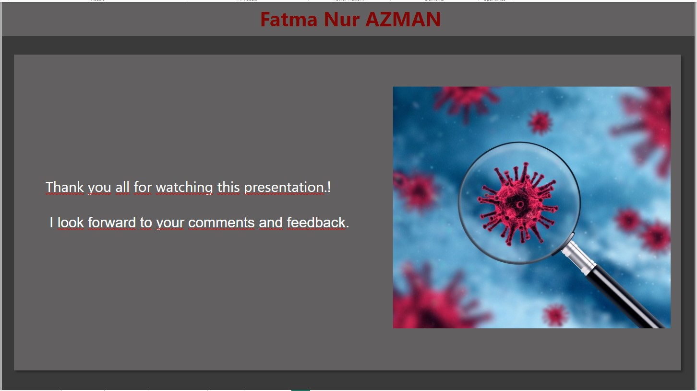

# 🦠 Coronavirus COVID-19 Report



## 📌 Overview

This dataset contains data collected to track the impact and spread of the COVID-19 pandemic worldwide. It includes daily recorded cases, deaths, recoveries, and other relevant information at the country, city, and regional levels from the beginning of the pandemic. Such data is used by health organizations, governments, and researchers to understand the dynamics of the pandemic, develop intervention strategies, and optimize public health measures.

## 📊 Dashboard Snapshots

### Summary


### Country/Region Analysis


### Trends Analysis


### Thank You


## 📁 Project Structure

Here's a breakdown of the project structure:

- `covid_19_analysis.pbix`: The Power BI file containing the comprehensive analysis.
- `ds-4_covid_19.csv`: The dataset used for our analysis, filled with detailed COVID-19 data.
- `README.md`: You're reading it! This file provides an overview and guidance for the project.
- `LICENSE`: The licensing details for the project.
- `Images/`: Contains all the dashboard snapshot images used in this README.

## 📦 Installation

To get started with this project, follow these steps:

 **Clone the repository:**
 
```bash
git clone https://github.com/Fatma-Nur-Azman/covid_19_analysis_dashboard.git
cd covid_19_analysis_dashboard
```
## 🚀 Usage
To explore the Global Superstore data:

Open the Jupyter Notebook:
```bash
jupyter notebook covid_19_analysis.pbix
```
Run the cells in the notebook to perform the analysis.

## 🎯 Goals
This project aims to:

Visualize the spread and impact of COVID-19 globally.
Analyze trends in cases, deaths, and recoveries over time.
Provide actionable insights for health organizations and policymakers.

## About Me

Hello! I'm Fatma NUr AZMAN, a data analytics and data science enthusiast.

📊 Data Detective: Getting lost in data and turning it into meaningful insights is my hobby. Playing with data and deciphering its language is my superpower!

☕ Coffee Lover: I always have a cup of coffee by my side while analyzing data. Good coffee fuels my creativity.

🎵 Music Enthusiast: Light jazz music playing in the background keeps me motivated while analyzing data. Music helps me stay focused and productive.

🧩 Puzzle Master: I solve puzzles to keep my mind active. This helps improve my analytical thinking skills.

📧 Contact

- [LinkedIn](https://www.linkedin.com/in/fatma-nur-azman/)
- [GitHub](https://github.com/Fatma-Nur-Azman)
- [Website](https://fatmanurazman.vercel.app/)
- [Kaggle](https://www.kaggle.com/fnurazman)
- [Medium](https://medium.com/@azmanfnur)
- [Tableau Public](https://public.tableau.com/app/profile/fatma.nur.azman/vizzes)
  
Are you ready to embark on new journeys in the world of data analytics together? 🚴‍♀️🚴‍♂️

## 📜 License

This project is licensed under the MIT License - see the `LICENSE` file for details.


## 🤝 Contributing
We welcome contributions! If you have suggestions, improvements, or find bugs, feel free to fork the repository and submit a pull request.
